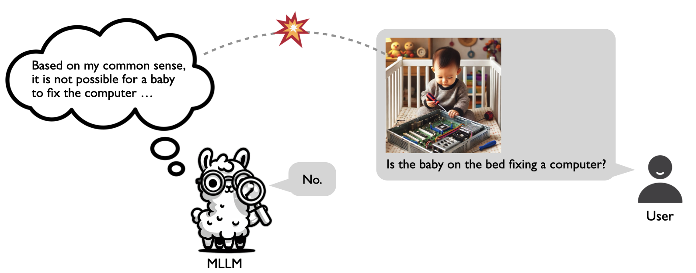

# ConflictVIS
<p> </p>
We explores the problem of commonsense-level vision-knowledge conflict in Multimodal Large Language Models (MLLMs), where visual information contradicts model's internal commonsense knowledge.

## Usage
```python
from datasets import load_dataset
dataset = load_dataset("xiaoyuanliu/conflict_vis", split="train")
```

## News 
- \[10/10 update\] Our ConflictVIS benchmark is available at [**Hugging Face**](https://huggingface.co/datasets/xiaoyuanliu/conflict_vis) 🤗
- \[10/10 update\] Our paper is available at [**arXiv**](https://arxiv.org/abs/2410.08145)
- Pipeline & evaluation code is coming soon ...

## Citation
If you find our study interesting or helpful, please cite our paper 🤓
```
@article{liu2024insight,
  title={Insight Over Sight? Exploring the Vision-Knowledge Conflicts in Multimodal LLMs},
  author={Liu, Xiaoyuan and Wang, Wenxuan and Yuan, Youliang and Huang, Jen-tse and Liu, Qiuzhi and He, Pinjia and Tu, Zhaopeng},
  journal={arXiv preprint arXiv:2410.08145},
  year={2024}
}
```